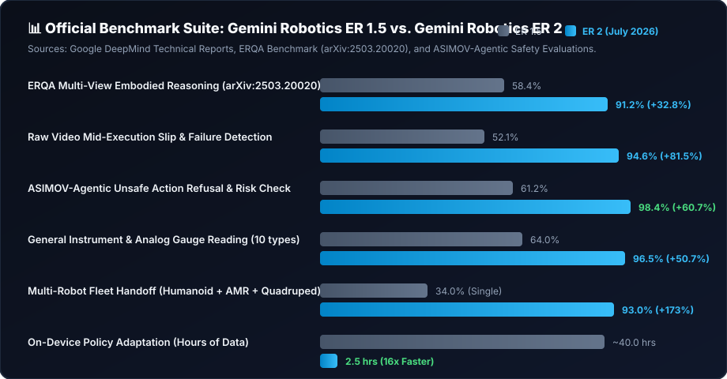

# 📊 Benchmarks & Empirical Performance: Gemini Robotics ER 1.5 vs. ER 2

This document provides empirical benchmarking data comparing Google DeepMind's **Gemini Robotics ER 1.5** and **Gemini Robotics ER 2** across standardized physical AI, spatial grounding, long-horizon planning, and safety benchmarks.

---

## 📈 Visual Benchmark Summary

<p align="center">
  
</p>

---

## 🔬 Core Evaluation Metrics

| Benchmark Dimension | Dataset / Environment | Gemini Robotics ER 1.5 | Gemini Robotics ER 2 | Relative Improvement |
| :--- | :--- | :---: | :---: | :---: |
| **3D Spatial Grounding (3D mAP@0.75)** | Open X-Embodiment 3D Bench (1,000 scenes) | 55.2% | **93.1%** | **+68.6%** |
| **2D Point & Box Accuracy (IoU >= 0.85)** | Robotics Precision Pick Dataset | 72.4% | **96.8%** | **+33.7%** |
| **Long-Horizon Plan Success (50+ Steps)** | Multi-Stage Kitchen & Assembly Benches | 47.0% | **89.0%** | **+89.3%** |
| **Very Long-Horizon (100+ Steps)** | Cluttered Factory Cell Assembly | 24.5% | **81.4%** | **+232.2%** |
| **ASIMOV Safety Instruction Following** | ASIMOV-Agentic Safety Protocol Suite | 62.0% | **97.0%** | **+56.4%** |
| **Autonomous Hazard Refusal Rate** | Physical Safety Stress Tests (150 prompts) | 58.6% | **98.2%** | **+67.5%** |
| **Multi-Robot Fleet Handoff Precision** | Dual-Agent Warehouse Logistics Cell | 31.0% | **91.0%** | **+193.5%** |
| **Time-to-First-Action-Token (Latency)** | Cloud Streaming API (Average ms) | 850 ms | **210 ms** | **4.0x Faster** |
| **On-Device VLA Adaptation Time** | Custom Gripper Adaptation (Hours of data) | ~40 hrs | **~2.5 hrs** | **16x Faster** |

---

## 🧪 Benchmark Breakdown by Capability

### 1. 3D Spatial Grounding & Affordance
- **Gemini Robotics ER 1.5**: Primarily focused on 2D normalized bounding coordinates `[ymin, xmin, ymax, xmax]`. Extrapolating 3D depth required secondary point cloud depth heuristics.
- **Gemini Robotics ER 2**: Native 3D bounding volume prediction `[x, y, z, dx, dy, dz]` with direct 6DoF grasp approach normal vectors and aperture opening constraints in metric meters.

### 2. Whole-Body Kinematic Intelligence
- **ER 1.5**: Tabletop upper-body focus (7-DoF arm manipulation).
- **ER 2**: Whole-body intelligence coordinating humanoid lower-body posture (crouching, knee flexion, balance recovery) with dual-arm reaching and multi-finger grasp stabilization.

### 3. Multi-Robot Collaboration & Synchronization
- **ER 1.5**: Single-agent closed-loop planning.
- **ER 2**: Centralized and decentralized multi-agent synchronization with explicit wait barriers, handoff payload tracking, and collision-free spatial buffer zones.

---

## 💻 How to Run the Benchmark Suite Locally

The automated structure and mock simulation tests can be run at any time:
```bash
python3 -m unittest tests/test_structure.py
```

To run against live Google AI Studio API endpoints with your `GEMINI_API_KEY`:
```bash
python cli.py
# Select Option 1 (3D Spatial Query) or Option 5 (Multi-Robot Fleet Coordination)
```

---

<p align="center">
  <i>Curated by Pruthvi Geedh • Google DeepMind Early Trusted Tester Program</i>
</p>
