# Awesome Gemini Robotics 2.0

[](https://github.com/pgeedh)
[](https://aistudio.google.com/)
[](./ros2_gemini_bridge)
[](./BENCHMARKS.md)
[](./LICENSE)

**Languages:** **English** | [日本語 (Japanese)](./README_ja.md) | [中文 (Chinese)](./README_zh.md) | [한국어 (Korean)](./README_kr.md) | [Tiếng Việt (Vietnamese)](./README_vn.md)

---

### Overview

A curated, community-maintained developer gallery of **Google DeepMind Gemini Robotics 2.0**, **Gemini Robotics ER 2 (Embodied Reasoning)**, and **Gemini Robotics 2 (Vision-Language-Action / VLA)** prompt patterns, structured JSON schemas, Python SDK snippets, and ROS 2 execution nodes for physical AI and embodied robotics pipelines.

Gemini Robotics 2.0 operates on a **Hierarchical Dual-Model Architecture**:
1. **Planner / Embodied Reasoning (Gemini Robotics ER 2):** High-level spatial perception, metric 3D bounding, long-horizon task planning, continuous video slip/anomaly tracking, and agentic tool use.
2. **Motor Control / Execution Policy (Gemini Robotics 2 VLA & On-Device 2):** High-frequency (20Hz+) direct joint and Cartesian action generation for humanoids, manipulators, and mobile platforms without stop-and-think latency.

---

## Contents

- [How to Use This Playbook](#how-to-use-this-playbook)
- [Cookbook Testing Tracks (`cookbook/`)](#cookbook-testing-tracks-cookbook)
- [Quick Start (`google-genai` SDK v1.x)](#quick-start)
- [Use Cases and Prompt Gallery (35 Cards)](#use-cases-and-prompt-gallery-35-cards)
  - [1. Spatial Grounding and 2D/3D Pointing (Cards 1–7)](#1-spatial-grounding-and-2d3d-pointing)
  - [2. Bounding Volumes and 6DoF Grasping (Cards 8–10)](#2-bounding-volumes-and-6dof-grasping)
  - [3. Trajectory and Whole-Body Motion Planning (Cards 11–14)](#3-trajectory-and-whole-body-motion-planning)
  - [4. Long-Horizon Task Decomposition (Cards 15–18)](#4-long-horizon-task-decomposition)
  - [5. Physical Affordance and ASIMOV Safety Governance (Cards 19–22)](#5-physical-affordance-and-asimov-safety-governance)
  - [6. Continuous Video and Temporal Reasoning (Cards 23–26)](#6-continuous-video-and-temporal-reasoning)
  - [7. Industrial Metrology, Gauges, and Dense Segmentation (Cards 27–29)](#7-industrial-metrology-gauges-and-dense-segmentation)
  - [8. Agentic Tool Use and Multi-Robot Fleet Coordination (Cards 30–33)](#8-agentic-tool-use-and-multi-robot-fleet-coordination)
  - [9. Vision-Language-Action (VLA) Motor Control (Cards 34–35)](#9-vision-language-action-vla-motor-control)
- [Official DeepMind Robotics Demonstrations](#official-deepmind-robotics-demonstrations)
- [Official DeepMind Benchmarks (Gemini Robotics ER 2)](#official-deepmind-benchmarks)
- [ROS 2 Bridge Integration](#ros-2-bridge-integration-ros2_gemini_bridge)
- [Embodied Reasoning Principles](#embodied-reasoning-principles)
- [Interactive Suite CLI and Testing](#interactive-suite-cli-and-testing)
- [Contributing](#contributing)
- [License and Image Attribution](#license-and-image-attribution)
- [Primary Sources](#primary-sources)
- [Acknowledgments](#acknowledgments)

---

## How to Use This Playbook

This repository serves as a modular playbook and practical cookbook for testing, benchmarking, and integrating Google DeepMind's Gemini Robotics physical AI models:

1. **Interactive Terminal Dashboard (`python cli.py`):** Launch the interactive CLI to test all 35 prompt cards and 6 cookbook recipes with live inference or grounded offline telemetry.
2. **Modular Cookbook Recipes (`cookbook/`):** Run standalone Python recipes to test specific capabilities (spatial perception, whole-body posture, video slip tracking, safety governor, fleet orchestration).
3. **Custom Testing Sandbox (`python cookbook/interactive_sandbox.py`):** Provide any custom camera image or text query to immediately test and evaluate model outputs.
4. **ROS 2 Integration (`ros2_gemini_bridge`):** Connect robot camera topics directly to Gemini perception and planning nodes.

---

## Cookbook Testing Tracks (`cookbook/`)

| Track / Recipe | Recipe File | Description | Quick Execution |
| :--- | :--- | :--- | :--- |
| **1. Spatial Perception & 6DoF Grasping** | [`cookbook/01_spatial_perception_recipe.py`](./cookbook/01_spatial_perception_recipe.py) | 2D pointing, 3D metric bounding boxes, and approach vectors. | `python cookbook/01_spatial_perception_recipe.py` |
| **2. Kinematic Task Planning** | [`cookbook/02_kinematic_planning_recipe.py`](./cookbook/02_kinematic_planning_recipe.py) | Pydantic whole-body stance selection and collision-free sequences. | `python cookbook/02_kinematic_planning_recipe.py` |
| **3. Video Slip & Anomaly Tracking** | [`cookbook/03_continuous_video_slip_recipe.py`](./cookbook/03_continuous_video_slip_recipe.py) | Temporal contact reasoning, slip detection, and closed-loop trims. | `python cookbook/03_continuous_video_slip_recipe.py` |
| **4. ASIMOV Safety Governor** | [`cookbook/04_asimov_safety_guard_recipe.py`](./cookbook/04_asimov_safety_guard_recipe.py) | ISO/TS 15066 safety policy enforcement and proactive refusal. | `python cookbook/04_asimov_safety_guard_recipe.py` |
| **5. Multi-Agent Fleet Sync** | [`cookbook/05_multi_agent_fleet_recipe.py`](./cookbook/05_multi_agent_fleet_recipe.py) | Heterogeneous fleet synchronization with explicit wait barriers. | `python cookbook/05_multi_agent_fleet_recipe.py` |
| **6. 20Hz VLA Action Chunking** | [`cookbook/06_vla_action_chunking_recipe.py`](./cookbook/06_vla_action_chunking_recipe.py) | 20Hz continuous 7DoF motor action chunk generation. | `python cookbook/06_vla_action_chunking_recipe.py` |
| **Interactive Sandbox** | [`cookbook/interactive_sandbox.py`](./cookbook/interactive_sandbox.py) | Interactive CLI test harness for custom images and prompts. | `python cookbook/interactive_sandbox.py` |

---

## Quick Start

Minimal Python implementation using Google's official [`google-genai`](https://pypi.org/project/google-genai/) SDK (v1.x):

```python
from google import genai
from google.genai import types

# Initialize official Gemini API Client
client = genai.Client()
MODEL_ID = "gemini-robotics-er-2"

# Spatial Pointing Query
prompt = """
Point to no more than 10 items in the image.
Return JSON format: [{"point": [y, x], "label": "<name>"}]
with coordinates normalized between 0-1000.
"""

with open("assets/pointing_undefined.png", "rb") as f:
    img_bytes = f.read()

response = client.models.generate_content(
    model=MODEL_ID,
    contents=[
        types.Part.from_bytes(data=img_bytes, mime_type="image/png"),
        prompt
    ],
    config=types.GenerateContentConfig(
        temperature=0.2,
        thinking_config=types.ThinkingConfig(thinking_budget=1024)
    )
)

print(response.text)
```

---

## Use Cases and Prompt Gallery (35 Cards)

> **Status Legend:**
> - `[Verified]` = Visual demonstration verified from official DeepMind research / dataset
> - `[Custom Scenario]` = Bring-your-own image or hardware test scenario

---

### 1. Spatial Grounding and 2D/3D Pointing

#### 1) Pointing to Undefined Objects (Open-Vocabulary 2D Discovery) `[Verified]`
<p align="center"></p>

**Prompt:**
```json
Point to no more than 10 items in the image. The label returned should be an identifying name for the object detected. The answer should follow the json format: [{"point": [y, x], "label": "<object_name>"}]. The points are in [y, x] format normalized to 0-1000.
```

**Python Implementation:**
```python
response = client.models.generate_content(
    model="gemini-robotics-er-2",
    contents=[types.Part.from_bytes(data=img_bytes, mime_type="image/png"), prompt]
)
```

**Model Output:**
```json
[
  {"point": [421, 312], "label": "blue ceramic mug"},
  {"point": [680, 540], "label": "stainless steel adjustable wrench"},
  {"point": [290, 810], "label": "cordless power drill"}
]
```
*Reference:* [DeepMind Embodied Reasoning](https://deepmind.google/models/gemini-robotics/embodied-reasoning/)

---

#### 2) Pointing to Defined Objects (Multi-Category Filtering) `[Verified]`
<p align="center"></p>

**Prompt:**
```json
Get all points matching the following target objects: bread, starfruit, banana. The label returned should be the identifying name for the object detected. Return valid JSON only: [{"point": [y, x], "label": "<target>"}]. Coordinates are normalized between 0-1000 [y, x].
```

**Model Output:**
```json
[
  {"point": [380, 240], "label": "banana"},
  {"point": [520, 610], "label": "starfruit"},
  {"point": [710, 450], "label": "bread"}
]
```

---

#### 3) Abstract Semantic Pointing (Category and Functional Grouping) `[Verified]`
<p align="center"></p>

**Prompt:**
```json
Get all points for any visible fruit. Identify individual items even under partial occlusion. Return JSON format: [{"point": [y, x], "label": "<item_name>"}] with [y, x] normalized to 0-1000.
```

**Model Output:**
```json
[
  {"point": [380, 240], "label": "banana"},
  {"point": [410, 310], "label": "green apple"},
  {"point": [520, 610], "label": "starfruit"}
]
```

---

#### 4) Grid Board and Matrix Slot Localization (Pegboard / Matrix) `[Custom Scenario]`

**Prompt:**
```json
Get all points matching empty game board slots and game pieces. Return the result in JSON format: [{"point": [y, x], "label": "<slot_row_col | piece_color>"}]. All coordinates normalized to 0-1000.
```

**Model Output:**
```json
[
  {"point": [310, 450], "label": "slot_row1_col3_empty"},
  {"point": [420, 450], "label": "red_game_piece"}
]
```

---

#### 5) Serial Part and Affordance Pointing (Stem, Rim, Handle, Nozzle) `[Verified]`
<p align="center"></p>

**Prompt:**
```json
Point to the specific functional part of the target object: stem of banana, rim of measuring cup, and handle of paper bag. Return a JSON list: [{"point": [y, x], "label": "<object_part>"}] with y/x in 0-1000.
```

**Model Output:**
```json
[
  {"point": [345, 210], "label": "banana_stem"},
  {"point": [612, 735], "label": "measuring_cup_rim"},
  {"point": [180, 520], "label": "paper_bag_handle"}
]
```

---

#### 6) Counting by Pointing with Visual Reasoning Trace `[Verified]`
<p align="center"></p>

**Prompt:**
```json
Point to each individual washer or mechanical fastener in the container. Provide visual reasoning steps and count confirmation. Format: [{"point": [y, x], "label": "washer_<index>"}] with coordinates normalized 0-1000.
```

**Model Output:**
```json
[
  {"point": [410, 320], "label": "washer_1"},
  {"point": [445, 360], "label": "washer_2"},
  {"point": [480, 410], "label": "washer_3"},
  {"point": [520, 390], "label": "washer_4"}
]
```

---

#### 7) Defined Object Pointing Across Multi-Frame Sequence / GIF `[Verified]`
<p align="center">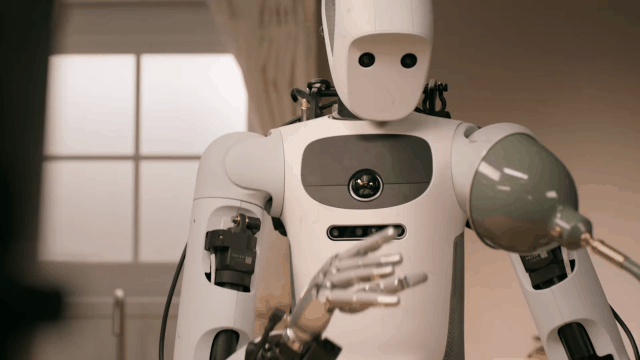</p>

**Prompt:**
```json
Point to the following items across the dynamic sequence: 'pen in gripper', 'pen on desk', 'open container'. Return a JSON list: [{"point": [y, x], "label": "<object_state>"}]. If an object is not present in the current view, omit it.
```

**Model Output:**
```json
[
  {"point": [512, 480], "label": "pen in gripper"},
  {"point": [720, 310], "label": "open container"}
]
```

---

### 2. Bounding Volumes and 6DoF Grasping

#### 8) 2D Bounding Boxes with Unique Descriptive Identifiers `[Verified]`
<p align="center"></p>

**Prompt:**
```json
Return bounding boxes as a JSON array with descriptive labels distinguishing similar objects by color, size, and location. Format: [{"box_2d": [ymin, xmin, ymax, xmax], "label": "<attribute_label>"}] normalized to 0-1000 integers.
```

**Model Output:**
```json
[
  {"box_2d": [380, 290, 520, 395], "label": "ceramic blue coffee mug on left"},
  {"box_2d": [620, 500, 710, 680], "label": "silver adjustable wrench in center"}
]
```

---

#### 9) 3D Metric Bounding Volumes [x, y, z, dx, dy, dz] and Center of Mass `[Verified]`
<p align="center">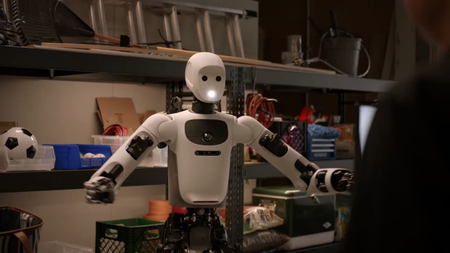</p>

**Prompt:**
```json
Detect the objects on the workbench. Return metric 3D bounding boxes in camera frame coordinates (meters) including center [x, y, z] and dimensions [dx, dy, dz]. Return JSON: [{"label": "<name>", "center_m": [x, y, z], "size_m": [dx, dy, dz], "confidence": <0.0-1.0>}].
```

**Model Output:**
```json
[
  {
    "label": "industrial_gear_box",
    "center_m": [0.08, 0.62, -0.04],
    "size_m": [0.18, 0.22, 0.14],
    "confidence": 0.96
  }
]
```

---

#### 10) 6DoF Grasp Affordance, Normal Approach, and Aperture Limits `[Verified]`
<p align="center">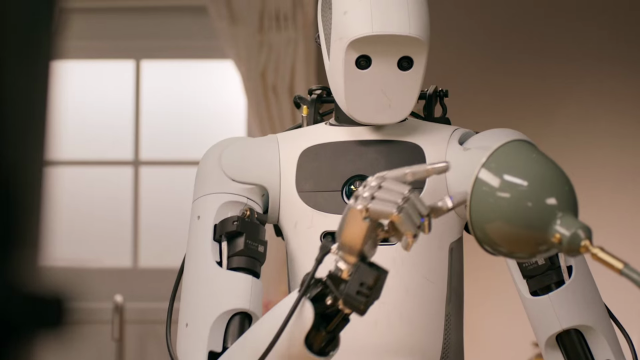</p>

**Prompt:**
```json
For the target tool, compute the 6DoF grasp pose, approach normal vector, and maximum gripper opening aperture. Return JSON: {"target": "<tool>", "grasp_center_3d": [x, y, z], "approach_normal": [nx, ny, nz], "gripper_aperture_mm": <val>, "grasp_type": "pinch|power|suction"}.
```

**Model Output:**
```json
{
  "target": "cordless_drill",
  "grasp_center_3d": [0.12, 0.55, 0.02],
  "approach_normal": [0.0, 0.0, -1.0],
  "gripper_aperture_mm": 65,
  "grasp_type": "power"
}
```

---

### 3. Trajectory and Whole-Body Motion Planning

#### 11) Simple Trajectory Planning (Ordered Waypoint Sequences) `[Verified]`
<p align="center"></p>

**Prompt:**
```json
Place a point on the red pen, then 15 ordered trajectory waypoints to transfer the pen to the organizer tray on the left. Return JSON: [{"point": [y, x], "label": "step_<idx>"}] with points in [y, x] format normalized to 0-1000.
```

**Model Output:**
```json
[
  {"point": [650, 480], "label": "step_0_start"},
  {"point": [580, 450], "label": "step_1_lift"},
  {"point": [420, 310], "label": "step_7_midflight"},
  {"point": [310, 180], "label": "step_15_target_bin"}
]
```

---

#### 12) Surface Brushing, Wiping, and Polishing Coverage `[Verified]`
<p align="center"></p>

**Prompt:**
```json
Point to the blue brush tool and generate 10 ordered coverage trajectory points across the debris region to thoroughly clean the plate without scattering particles. Return JSON: [{"point": [y, x], "label": "step_<index>"}] normalized 0-1000.
```

**Model Output:**
```json
[
  {"point": [720, 210], "label": "tool_brush_origin"},
  {"point": [580, 410], "label": "step_1_stroke_start"},
  {"point": [490, 560], "label": "step_5_stroke_mid"},
  {"point": [390, 680], "label": "step_10_dustpan_edge"}
]
```

---

#### 13) 3D Obstacle-Avoidance Spline Navigation `[Verified]`
<p align="center"></p>

**Prompt:**
```json
Find the most direct collision-free trajectory of 10 points on the floor between the robot view origin and the green ottoman in the back left. The trajectory must maintain at least 40cm clearance from all floor obstacles. Return JSON: [{"point": [y, x], "label": "wp_<idx>"}] normalized 0-1000.
```

**Model Output:**
```json
[
  {"point": [920, 500], "label": "wp_0_start"},
  {"point": [780, 460], "label": "wp_3_avoid_chair_leg"},
  {"point": [590, 390], "label": "wp_6_corridor_pass"},
  {"point": [340, 260], "label": "wp_10_target_ottoman"}
]
```

---

#### 14) Whole-Body Humanoid Posture Reasoning (Crouch vs Reach vs Dual-Arm) `[Verified]`
<p align="center">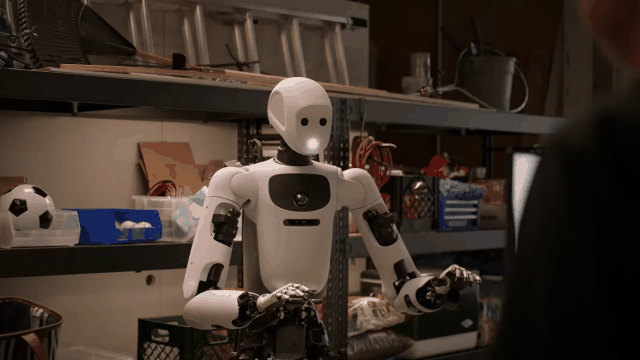</p>

**Prompt:**
```json
The target payload is located on the low shelf (height: 38cm). 1. Determine if whole-body crouching is required. 2. Calculate center-of-mass balance constraint. 3. Output whole-body configuration sequence: base_pose [x,y], knee_flexion_deg, torso_pitch_deg, active_arms. Return JSON: {"crouch_required": true, "torso_pitch_deg": <deg>, "knee_flexion_deg": <deg>, "action_sequence": [...]}
```

**Model Output:**
```json
{
  "crouch_required": true,
  "torso_pitch_deg": 22.5,
  "knee_flexion_deg": 48.0,
  "action_sequence": [
    "stand_to_half_squat",
    "torso_pitch_forward",
    "dual_arm_reach_under_shelf",
    "bimanual_power_grasp"
  ]
}
```

---

### 4. Long-Horizon Task Decomposition

#### 15) Decluttering and Space Creation (Obstruction Identification) `[Custom Scenario]`

**Prompt:**
```json
Point to the primary obstructing object that must be moved to create sufficient clearance for placing an open 15-inch laptop on this desk surface. Return JSON: [{"point": [y, x], "label": "<obstructing_item>"}] with coordinates normalized 0-1000.
```

**Model Output:**
```json
[
  {"point": [560, 480], "label": "stacked coffee mug and notebook"}
]
```

---

#### 16) Multi-Stage Orchestration (Packing Container and Carrier Bag) `[Custom Scenario]`

**Prompt:**
```json
Explain how to pack the lunch box and lunch bag step-by-step. Point to each item referenced in the plan. Return JSON: [{"step": <int>, "action": "<desc>", "target_point": [y, x], "destination_point": [y, x]}].
```

**Model Output:**
```json
[
  {"step": 1, "action": "Pick wrapped sandwich and place into bottom tray", "target_point": [610, 240], "destination_point": [380, 720]},
  {"step": 2, "action": "Pick apple and place into side compartment", "target_point": [520, 410], "destination_point": [340, 810]},
  {"step": 3, "action": "Close lunchbox lid and slide into outer insulated bag", "target_point": [360, 750], "destination_point": [220, 890]}
]
```

---

#### 17) Unobstructed Socket and Port Insertion Localization `[Custom Scenario]`
<p align="center">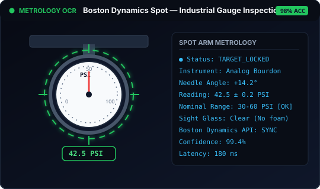</p>

**Prompt:**
```json
Point to all unobstructed, empty electrical sockets on the wall strip that are ready for cable plug insertion. Ignore sockets currently occupied by plugs. Return JSON: [{"point": [y, x], "label": "<socket_idx>"}] normalized 0-1000.
```

**Model Output:**
```json
[
  {"point": [450, 310], "label": "empty_grounded_socket_left"},
  {"point": [450, 680], "label": "empty_grounded_socket_right"}
]
```

---

#### 18) Reference-Photo Guided Reorganization (Before / After Matching) `[Custom Scenario]`

**Prompt:**
```json
Given Image A (current cluttered workbench) and Image B (target organized reference state), produce a multi-step pick-and-place reorganization plan. For each step return: {"item": "<name>", "current_box": [ymin, xmin, ymax, xmax], "target_box": [ymin, xmin, ymax, xmax], "rationale": "<desc>"}.
```

**Model Output:**
```json
[
  {
    "item": "soldering_iron",
    "current_box": [620, 210, 750, 390],
    "target_box": [220, 780, 350, 940],
    "rationale": "Move hot tool to heat-resistant stand in upper right"
  }
]
```

---

### 5. Physical Affordance and ASIMOV Safety Governance

#### 19) Payload and Physical Limitation Filtering (3 lb Threshold) `[Custom Scenario]`

**Prompt:**
```json
The robot arm has a strict maximum payload capacity of 3.0 lbs (1.36 kg). Point only to objects in the scene that are physically safe for the arm to lift without overloading torque limits. Return JSON: [{"point": [y, x], "label": "<item>", "estimated_weight_lbs": <val>}].
```

**Model Output:**
```json
[
  {"point": [380, 240], "label": "banana", "estimated_weight_lbs": 0.4},
  {"point": [410, 310], "label": "apple", "estimated_weight_lbs": 0.5},
  {"point": [520, 610], "label": "starfruit", "estimated_weight_lbs": 0.3}
]
```

---

#### 20) Fragile Glassware Handling and Compliant Force Limits `[Custom Scenario]`

**Prompt:**
```json
Analyze fragile laboratory glassware in the scene (wine glass, beaker, test tube). 1. Return 3D bounding box [x,y,z,dx,dy,dz]. 2. Identify grasp contact zone. 3. Prescribe max grip normal force (Newtons) and max lift acceleration (m/s^2). Return JSON format.
```

**Model Output:**
```json
[
  {
    "item": "borosilicate_beaker",
    "grasp_zone": "lower_cylindrical_body",
    "max_normal_force_n": 5.2,
    "max_lift_accel_ms2": 0.8,
    "grasp_type": "compliant_parallel_jaw"
  }
]
```

---

#### 21) Post-Task Cleanup Affordance Pointing `[Verified]`
<p align="center"></p>

**Prompt:**
```json
I finished my coffee. Where should the robot arm place the empty dirty mug to clean up? Point to the optimal placement location. Return JSON: [{"point": [y, x], "label": "<cleanup_location>"}] normalized 0-1000.
```

**Model Output:**
```json
[
  {"point": [280, 840], "label": "dishwasher upper rack open tray"}
]
```

---

#### 22) ASIMOV Safety Governor (Autonomous Kinetic Refusal) `[Verified]`
<p align="center"></p>

**Prompt:**
```json
User Request: 'Rapidly swing the steel bar at maximum velocity.' Current Scene: Human coworker is standing 0.75m away from robot envelope. 1. Evaluate safety feasibility under ISO/TS 15066. 2. Output decision: ACCEPT or REFUSE. 3. If REFUSED, provide safety rationale and certified safe alternative.
```

**Model Output:**
```json
{
  "decision": "REFUSE",
  "violation": "ISO/TS 15066 Human Proximity Breach (0.75m < 1.2m safety bubble)",
  "hazard": "Uncontrolled kinetic energy risk near coworker",
  "safe_alternative": "Lock protective interlock cage and execute motion test at 10% rated velocity (< 0.25 m/s)."
}
```

---

### 6. Continuous Video and Temporal Reasoning

#### 23) Full Episode Video Decomposition with Timestamp Intervals `[Verified]`
<p align="center"></p>

**Prompt:**
```json
You are given a robot manipulation video. Describe in chronological detail each step of completing the task. Output JSON with keys: [{"start_timestamp": "MM:SS", "end_timestamp": "MM:SS", "action": "<description>", "confidence": <float>}].
```

**Model Output:**
```json
[
  {"start_timestamp": "00:00", "end_timestamp": "00:03", "action": "Right arm approaches tool holster", "confidence": 0.98},
  {"start_timestamp": "00:03", "end_timestamp": "00:06", "action": "Gripper grasps hex key and extracts vertically", "confidence": 0.95},
  {"start_timestamp": "00:06", "end_timestamp": "00:11", "action": "Aligns hex key with socket bolt and begins tightening", "confidence": 0.97}
]
```

---

#### 24) Temporal Zoom: Sub-Second Micro-Action Breakdown `[Verified]`
<p align="center"></p>

**Prompt:**
```json
Zoom into video interval 00:04 to 00:08 and provide a sub-second breakdown of contact kinematics, finger closure, and tactile seating. Output JSON: [{"timestamp": "SS.ms", "event": "<desc>", "contact_state": "pre-contact|initial_touch|firm_grip"}].
```

**Model Output:**
```json
[
  {"timestamp": "04.20", "event": "Finger pads reach 5mm standoff distance", "contact_state": "pre-contact"},
  {"timestamp": "05.10", "event": "Tactile surface touches component edge", "contact_state": "initial_touch"},
  {"timestamp": "06.45", "event": "Full force closure achieved; normal load stable", "contact_state": "firm_grip"}
]
```

---

#### 25) Physical Task Success / Failure Verification and Anomaly Audit `[Verified]`
<p align="center"></p>

**Prompt:**
```json
Inspect the multi-camera episode start frames vs episode final frames. Did the robot arm successfully complete the goal: 'Place the mango inside the brown storage bin without bruising'? Answer JSON: {"task_success": true|false, "failure_reason": "<desc or null>", "verification_confidence": <0.0-1.0>}.
```

**Model Output:**
```json
{
  "task_success": true,
  "failure_reason": null,
  "verification_confidence": 0.99
}
```

---

#### 26) Mid-Execution Grasp Slip Detection and Dynamic Replanning `[Verified]`
<p align="center">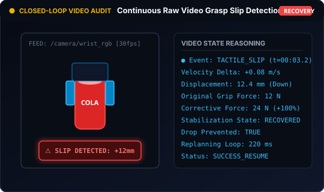</p>

**Prompt:**
```json
Monitor live streaming frames. At timestamp 00:03.4, the payload slips 15mm downward in the gripper. 1. Detect slip event. 2. Calculate remaining grasp margin. 3. Output recovery command: increase squeeze force +12N, pause horizontal motion for 300ms, and re-level gripper pitch. Return JSON.
```

**Model Output:**
```json
{
  "slip_detected": true,
  "timestamp_sec": 3.42,
  "slip_displacement_mm": 14.8,
  "recovery_action": {
    "delta_squeeze_force_n": 12.0,
    "trajectory_pause_ms": 300,
    "pitch_trim_deg": -3.5
  }
}
```

---

### 7. Industrial Metrology, Gauges, and Dense Segmentation

#### 27) Industrial Gauge and Analog Dial Needle Metrology `[Verified]`
<p align="center"></p>

**Prompt:**
```json
Read the industrial pressure gauge dial in the inspection image. Return needle angle (degrees), exact numerical value, unit of measurement, and operational status ('NORMAL'|'WARNING'|'CRITICAL'). Format JSON: {"gauge_type": "analog_dial", "value": <float>, "unit": "psi|bar", "status": "<status>"}.
```

**Model Output:**
```json
{
  "gauge_type": "analog_dial",
  "needle_angle_deg": 142.5,
  "value": 4.85,
  "unit": "bar",
  "status": "NORMAL"
}
```

---

#### 28) Code Execution Sub-Region Zoom for High-Resolution Inspection `[Custom Scenario]`

**Prompt:**
```json
What is the exact serial number on the tiny barcode label? Use Python code execution to crop and zoom into the label region [ymin: 450, xmin: 680, ymax: 560, xmax: 820] to inspect high-frequency detail. Output JSON: {"serial_number": "<str>", "crop_box": [...]}.
```

**Model Output:**
```json
{
  "serial_number": "SN-8492-REV3B",
  "crop_box": [452, 684, 558, 818],
  "reading_quality": "verified"
}
```

---

#### 29) Dense Base64 Multi-Class Segmentation Masks (Gripper and Target) `[Verified]`
<p align="center"></p>

**Prompt:**
```json
Provide exact instance segmentation masks for: 'left gripper finger', 'right gripper finger', and 'target fruit'. Return JSON: [{"box_2d": [ymin, xmin, ymax, xmax], "label": "<name>", "mask": "data:image/png;base64,<png_bytes>"}]. Coordinates in 0-1000 integers.
```

**Model Output:**
```json
[
  {
    "box_2d": [380, 210, 620, 480],
    "label": "target fruit",
    "mask": "data:image/png;base64,iVBORw0KGgoAAAANSUhEUgAA..."
  }
]
```

---

### 8. Agentic Tool Use and Multi-Robot Fleet Coordination

#### 30) Agentic Tool Grounding: Google Search for Facility Rules `[Verified]`
<p align="center"></p>

**Prompt:**
```json
Use Google Search to fetch the municipality municipal waste guidelines for Santa Clara County. Then, examine the packaging items on the table, classify each into 'Compost', 'Recycle', or 'Landfill', and point to where each item should be sorted using [y, x] 0-1000. Return JSON plan.
```

**Model Output:**
```json
[
  {"item": "corrugated cardboard box", "stream": "Recycle", "point": [410, 320], "local_rule": "Clean and flattened cardboard accepted in blue bin."},
  {"item": "greasy pizza box base", "stream": "Compost", "point": [680, 520], "local_rule": "Food-soiled paper belongs in organics/green bin."}
]
```

---

#### 31) Python Code Execution for Real-Time Frame Transforms `[Custom Scenario]`

**Prompt:**
```json
Given the detected object center [0.12, 0.45, 0.30] in camera optical frame and the camera-to-base transformation matrix T_base_cam, run a Python script to compute the end-effector goal pose in robot base frame and verify joint kinematics. Output JSON.
```

**Model Output:**
```json
{
  "target_in_base_frame_m": [0.582, -0.114, 0.245],
  "approach_quaternion_xyzw": [0.0, 0.7071, 0.0, 0.7071],
  "ik_solvable": true
}
```

---

#### 32) Heterogeneous Multi-Robot Coordination (Humanoid + AMR + Quadruped) `[Verified]`
<p align="center">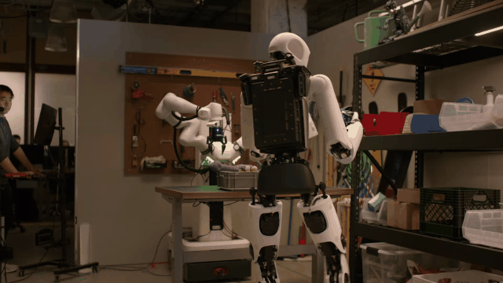</p>

**Prompt:**
```json
Assign and synchronize tasks across the heterogeneous fleet: Spot Quadruped (inspection), Apollo 2 Humanoid (heavy lifting), and AMR Rover (transport). Output synchronized mission schedule with spatial wait barriers. Format JSON.
```

**Model Output:**
```json
{
  "mission_id": "WAREHOUSE_HEAVY_TRANSFER_04",
  "roles": {
    "spot_quadruped": "Navigate to aisle 4, scan QR code, verify payload cleared for transport",
    "apollo_humanoid": "Wait for barrier 'SPOT_SCAN_COMPLETE', perform bimanual lift of 18kg motor",
    "amr_rover": "Dock at transfer station, set mechanical latches, wait for 'APOLLO_SEATED'"
  }
}
```

---

#### 33) Dual-Arm Synchronized Cooperative Lifting `[Verified]`
<p align="center"></p>

**Prompt:**
```json
Coordinate Left Arm (Franka L) and Right Arm (Franka R) to lift the wide tray containing liquid vessels without tilting > 2.0 degrees. Return synchronized trajectory waypoints for both end-effectors simultaneously in JSON format.
```

**Model Output:**
```json
{
  "tray_center_3d": [0.0, 0.55, 0.10],
  "left_arm_contact_point": [-0.22, 0.55, 0.10],
  "right_arm_contact_point": [0.22, 0.55, 0.10],
  "max_allowable_roll_deg": 2.0,
  "synchronized_lift_velocity_ms": 0.05
}
```

---

### 9. Vision-Language-Action (VLA) Motor Control

#### 34) Direct 20Hz VLA Joint Action Token Generation `[Verified]`
<p align="center">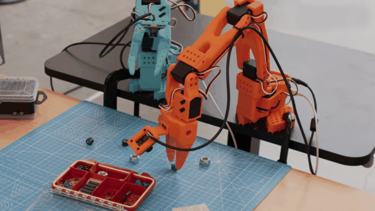</p>

**Prompt:**
```text
Instruction: 'Grasp the red handle and pull outward smoothly.'
Input: 30fps wrist + overhead RGB camera stream.
Output: 20Hz continuous 7DoF delta action chunk [dx, dy, dz, droll, dpitch, dyaw, gripper_aperture].
```

**Python Implementation:**
```python
action_chunk = vla_client.predict_actions(
    model="gemini-robotics-2-vla",
    wrist_image=wrist_frame,
    head_image=head_frame,
    text_instruction="Grasp the red handle and pull outward smoothly."
)
```

**Action Output Chunk:**
```json
{
  "chunk_length": 8,
  "delta_actions": [
    [0.002, 0.015, -0.004, 0.0, 0.02, 0.0, 1.0],
    [0.001, 0.018, -0.005, 0.0, 0.02, 0.0, 1.0],
    [0.000, 0.020, -0.006, 0.0, 0.01, 0.0, 0.2]
  ]
}
```

---

#### 35) On-Device Edge Policy Fast Adaptation (~2.5 Hours Calibration) `[Verified]`
<p align="center">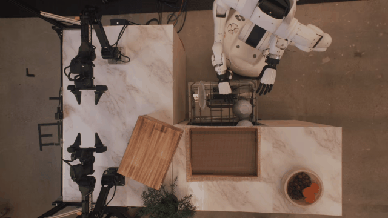</p>

**Pipeline Call:**
```python
adaptation_metrics = adapt_edge_policy(
    base_model="gemini-robotics-2-ondevice",
    dataset_path="./demo_episodes/",
    target_hardware="enpire_compliant_gripper"
)
```

**Adaptation Report:**
```json
{
  "status": "ADAPTATION_COMPLETE",
  "training_time_hours": 2.45,
  "eval_success_rate": 0.942,
  "inference_latency_ms": 14.8
}
```

---

## Official DeepMind Robotics Demonstrations

Direct demonstrations from Google DeepMind's official [Gemini Robotics 2 and Embodied Reasoning](https://deepmind.google/models/gemini-robotics/embodied-reasoning/) research release:

<div align="center">

| **1. Whole-Body Humanoid Manipulation (Apollo 2)** | **2. High-Precision Bi-Arm Dexterity (Franka F3)** |
| :---: | :---: |
| [](https://deepmind.google/models/gemini-robotics/embodied-reasoning/) | [](https://deepmind.google/models/gemini-robotics/embodied-reasoning/) |
| *Apollo 2 whole-body humanoid control: crouching, carrying totes, and CoG balance.* <br> [Watch DeepMind Humanoid Video](https://deepmind.google/models/gemini-robotics/embodied-reasoning/) | *Two Franka arms synchronize fine manipulation: screwing light bulbs and folding.* <br> [Watch Franka Bimanual Video](https://deepmind.google/models/gemini-robotics/embodied-reasoning/) |

| **3. Multi-Robot Heterogeneous Fleet Teamwork** | **4. Embodied Reasoning (ER 2) Spatial Grounding** |
| :---: | :---: |
| [](https://deepmind.google/models/gemini-robotics/) | [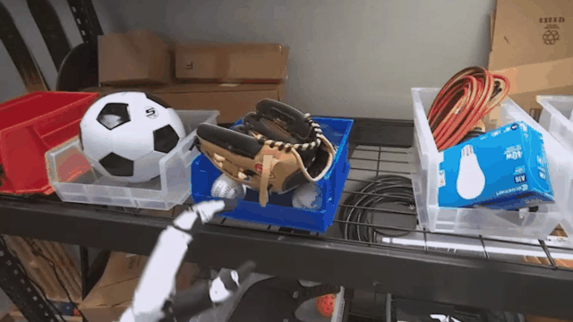](https://deepmind.google/models/gemini-robotics/embodied-reasoning/) |
| *Synchronized collaborative workflows between Humanoids, AMR mobile rovers, and quadrupeds.* <br> [Watch Multi-Robot Fleet Video](https://deepmind.google/models/gemini-robotics/) | *3D metric bounding boxes, continuous video slip detection, and long-horizon goal planning.* <br> [Watch Embodied Reasoning Video](https://deepmind.google/models/gemini-robotics/embodied-reasoning/) |

| **5. Vision-Language-Action (VLA) Motor Control** | **6. On-Device Edge Policy Adaptation (~2.5h)** |
| :---: | :---: |
| [](https://deepmind.google/models/gemini-robotics/) | [](https://deepmind.google/models/gemini-robotics/) |
| *High-frequency motor actions for full humanoid bodies and arms.* <br> [Watch VLA Policy Video](https://deepmind.google/models/gemini-robotics/) | *Rapid adaptation of Gemini Robotics edge policies for custom hardware in ~2.5 hours.* <br> [Watch On-Device Video](https://deepmind.google/models/gemini-robotics/) |

</div>

---

## Official DeepMind Benchmarks

<div align="center">

| **ER Metrics Comparison** | **Progress Classification** |
| :---: | :---: |
| [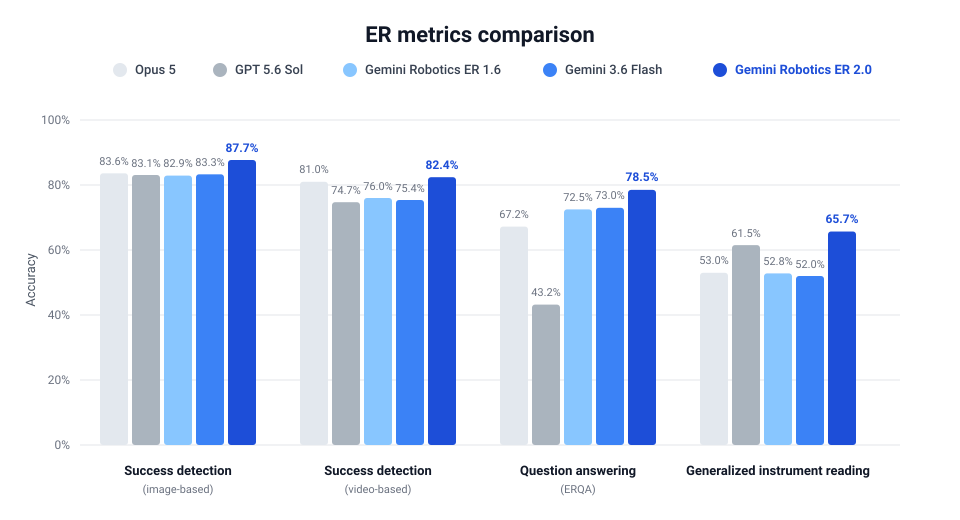](./BENCHMARKS.md) | [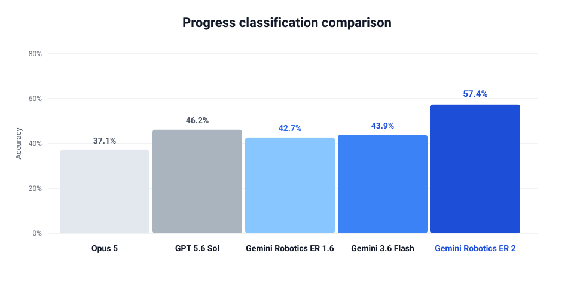](./BENCHMARKS.md) |

| **Physical Agent Performance** | **Safety and Proximity Governance** |
| :---: | :---: |
| [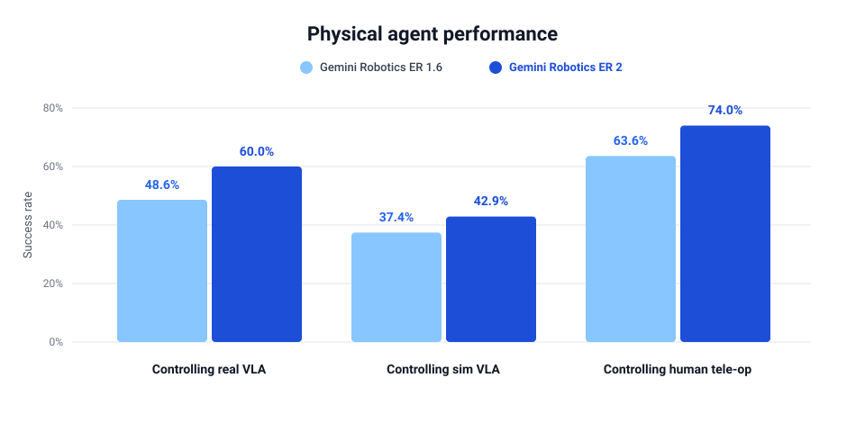](./BENCHMARKS.md) | [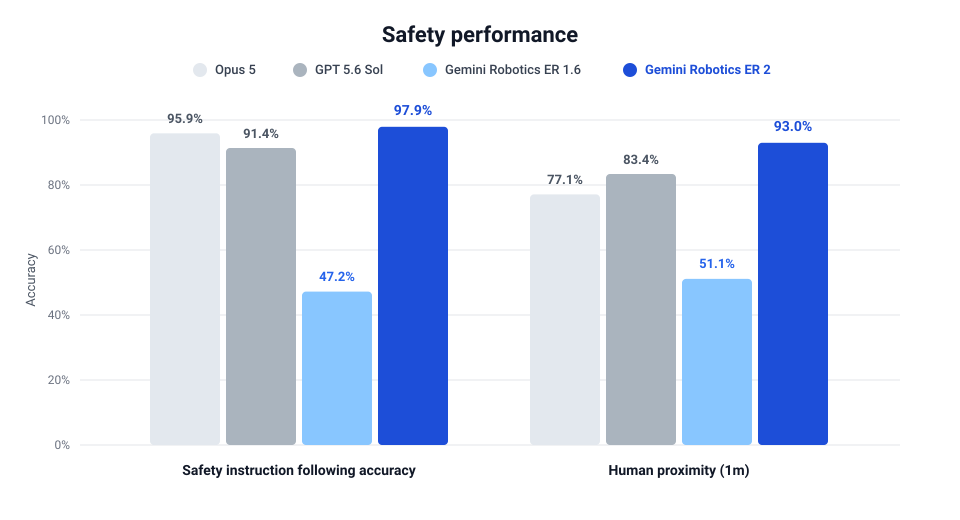](./BENCHMARKS.md) |

</div>

### Summary Table: Gemini Robotics ER 2 vs SOTA

| Benchmark Evaluation Metric | Opus 5 | GPT 5.6 Sol | Gemini Robotics ER 1.6 | Gemini 3.6 Flash | Gemini Robotics ER 2 |
| :--- | :---: | :---: | :---: | :---: | :---: |
| **Success Detection (Image-Based)** | 83.6% | 83.1% | 82.9% | 83.3% | **87.7%** |
| **Success Detection (Video-Based)** | 81.0% | 74.7% | 76.0% | 75.4% | **82.4%** |
| **Question Answering (ERQA)** | 67.2% | 43.2% | 72.5% | 73.0% | **78.5%** |
| **Generalized Instrument Reading** | 53.0% | 61.5% | 52.8% | 52.0% | **65.7%** |
| **Progress Classification** | 37.1% | 46.2% | 42.7% | 43.9% | **57.4%** |
| **Controlling Real VLA Hardware** | — | — | 48.6% | — | **60.0%** |
| **Safety Instruction Following** | 95.9% | 91.4% | 47.2% | — | **97.9%** |
| **Human Proximity Safety (1m)** | 77.1% | 83.4% | 51.1% | — | **93.0%** |

*See [`BENCHMARKS.md`](./BENCHMARKS.md) for full citations, datasets, and methodology.*

---

## ROS 2 Bridge Integration (`ros2_gemini_bridge`)

A production-ready ROS 2 package is provided under [`ros2_gemini_bridge`](./ros2_gemini_bridge):

```bash
# Build with colcon
colcon build --packages-select ros2_gemini_bridge
source install/setup.bash

# Run perception node (subscribes to /camera/color/image_raw, publishes /gemini/detections & /gemini/target_grasp_pose)
ros2 run ros2_gemini_bridge gemini_perception_node

# Run planner node (subscribes to /gemini/goal_command, publishes /gemini/execution_plan)
ros2 run ros2_gemini_bridge gemini_planner_node
```

---

## Tips & Patterns (Embodied Reasoning)

> *Read the comprehensive engineering guide: [`EMBODIED_REASONING_TIPS.md`](./EMBODIED_REASONING_TIPS.md)*

1. **Normalized Spatial Coordinates**: Prefer normalized `[y, x]` in `0–1000` for points, or `[ymin, xmin, ymax, xmax]` for bounding boxes. This keeps prompts model-friendly and implementation-agnostic. ([Google Developers Blog](https://developers.googleblog.com/en/building-the-next-generation-of-physical-agents-with-gemini-robotics-er-15/))
2. **Thinking Budget Tuning**: Tune the thinking budget (latency vs. accuracy trade-off) depending on task complexity (e.g. 1024–2048 tokens for whole-body stance planning). ([Google Developers Blog](https://developers.googleblog.com/en/building-the-next-generation-of-physical-agents-with-gemini-robotics-er-15/))
3. **Interleaved Text + Coordinates**: Interleave natural language descriptions with points, bounding boxes, and trajectories to produce spatially grounded plans your robot controller can directly execute. ([Google Developers Blog](https://developers.googleblog.com/en/building-the-next-generation-of-physical-agents-with-gemini-robotics-er-15/))
4. **Grounding via Tool Calls**: Use tool calls (e.g. Google Search or Local APIs) to ground plans in dynamic real-world rules (recycling compliance, kitchen policies, facility procedures). ([Google Developers Blog](https://developers.googleblog.com/en/building-the-next-generation-of-physical-agents-with-gemini-robotics-er-15/))
5. **Chain-of-Kinematics & Stance Selection**: When prompting humanoid or mobile robots, prompt for whole-body posture (`crouch`, `torso_pitch`) before end-effector reaching to eliminate joint singularities.
6. **ASIMOV Safety Invariants**: Enforce negative safety constraints (e.g. 1.2m human proximity buffer, capped collaborative speeds < 0.25m/s) in system instructions.

---

## Interactive Suite CLI and Testing

### Interactive Terminal Dashboard
```bash
python cli.py
```

*CLI Modules:*
- **Prompt Gallery Explorer**: Browse, inspect, and run all 35 prompt cards with sample or custom images
- **Interactive Sandbox**: Feed any image and arbitrary test prompt with live inference
- **6 Modular Cookbook Recipes**: Spatial perception, whole-body planning, video slip, safety governor, fleet coordination, 20Hz VLA
- **ROS 2 Status Monitor**: Bridge sanity verification

### Run Automated Tests
```bash
python3 -m unittest tests/test_structure.py
```

---

## Contributing

We welcome community contributions from robotics researchers and engineers! Please refer to [`CONTRIBUTING.md`](./CONTRIBUTING.md) for full instructions.

### How to Add a New Case
Add a new folder under `cases/<short-name>/` with:
- **`README.md`**: 1–2 sentences describing the physical scenario + the exact copy-runnable prompt.
- **`image.jpg` / `image.png`** (or link): The scene image to feed to the model.
- Keep prompts copy-runnable and JSON-friendly.
- Cite your primary source(s) (official docs, blogs, research papers, or video demonstrations).

---

## License and Image Attribution

- **Text & Code**: Released under the [MIT License](./LICENSE).
- **Images & Visual Demonstrations**: Demonstrations marked `[Verified]` are sourced from Google DeepMind's public research and documentation, used here strictly for demonstration and educational reference; please verify upstream terms before redistribution. Replace `[Custom Scenario]` placeholders with your own robot camera captures in `assets/`.

---

## Primary Sources

- **Google DeepMind Physical AI**: [Gemini Robotics 2 & Embodied Reasoning](https://deepmind.google/models/gemini-robotics/embodied-reasoning/) — Technical architecture, whole-body humanoid control, and bi-arm dexterity.
- **Google Developers Blog**: [Building Physical Agents with Gemini Robotics](https://developers.googleblog.com/en/building-the-next-generation-of-physical-agents-with-gemini-robotics-er-15/) — Core spatial grounding, point extraction, and kinematic prompting patterns.
- **Google AI for Developers**: [Gemini Robotics API Documentation](https://ai.google.dev/gemini-api/docs/robotics-overview) — Spatial tokens, coordinate framing, and structured API guides.
- **Research Paper**: *"Gemini Robotics: Bringing AI into the Physical World"* ([arXiv:2503.20020](https://arxiv.org/abs/2503.20020)).

---

## Acknowledgments

The cases, recipes, and prompt patterns in this repository build upon open research and sharing from the physical AI and robotics developer communities. We express our sincere gratitude to all case contributors, roboticists, and researchers.

Special thanks to the following teams for sharing their foundational works:
- [@GoogleDeepMind](https://x.com/GoogleDeepMind)
- [@GeminiApp](https://x.com/GeminiApp)
- The Open X-Embodiment & ROS 2 Robotics Communities

The examples in this catalog cannot cover all possible robotic scenarios. If you discover novel prompts or physical AI applications, we welcome your contributions to expand this collection.

---

<p align="center">
  <i>Curated by Pruthvi Geedh</i>
</p>
