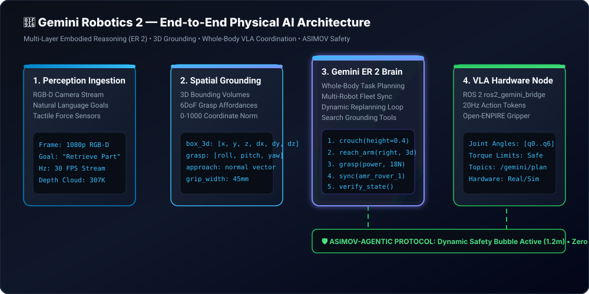
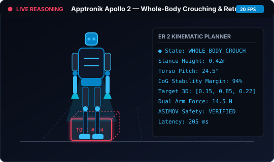
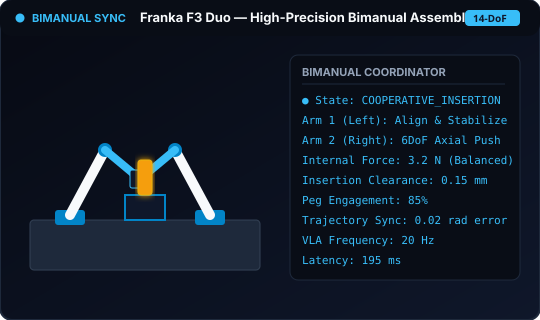

# Gemini Robotics 2 & ER 1.5 Insight Hub 

[](https://deepmind.google/models/gemini-robotics/embodied-reasoning/)
[](https://aistudio.google.com/)
[](./ros2_gemini_bridge)
[](./docs/architecture_3d_explainer.html)
[](./BENCHMARKS.md)

> **🚀 INSIGHTS FROM THE EARLY TRUSTED TESTER & PHYSICAL AI PROGRAM**
> This repository is the definitive open-source developer hub for **Google DeepMind's Gemini Robotics 2**, **Gemini Robotics-ER (Embodied Reasoning)**, and **Vision-Language-Action (VLA)** models, curated directly from official DeepMind research ([`deepmind.google/models/gemini-robotics/embodied-reasoning/`](https://deepmind.google/models/gemini-robotics/embodied-reasoning/)).
>
> Here you will find production code patterns, drop-in ROS 2 bridge nodes, 3D spatial grounding recipes, multi-robot fleet coordination, ASIMOV-Agentic safety protocols, and interactive 3D WebGL explainers.

---

## 🎮 Interactive 3D Visual Architecture Explainer

Explore the internal workings of Gemini Robotics 2 in 3D WebGL! Inspect how camera RGB-D streams map to multi-layer spatial attention tokens, 3D bounding boxes, whole-body kinematic plans, and 20Hz VLA joint trajectories.

<p align="center">
  <a href="./docs/architecture_3d_explainer.html">
    
  </a>
</p>
<p align="center">
  👉 <b><a href="./docs/architecture_3d_explainer.html">Launch Full Interactive 3D Architecture & Spatial Explainer in Browser</a></b>
</p>

---

## 🧠 Core Capabilities & Feature Cards (DeepMind Embodied Reasoning)

Gemini Robotics operates on a **Hierarchical Dual-Model Paradigm**:
- **The "Planner / Upper Brain" — Gemini Robotics ER 2:** High-level embodied reasoning model for physical space, 3D metric bounding, long-horizon planning, live video tracking, and safety orchestration.
- **The "Motor Cortex / Doer" — Gemini Robotics 2 (VLA) & On-Device 2:** High-frequency motor controllers generating joint trajectories without "stop-and-think" latency.

### 🗂️ The 8 Pillar Feature Cards

| Feature Pillar | DeepMind Capability Description | Real-World Application |
| :--- | :--- | :--- |
| **1. 📐 3D Metric & Spatial Grounding** | Predicts 3D bounding boxes `[x, y, z, dx, dy, dz]`, 6DoF grasp approach normal vectors, aperture opening limits, and fuses multi-camera streams (head + wrist sensors). | High-precision dexterous grasping, collision-free obstacle avoidance, bin picking. |
| **2. 📋 Hierarchical Task Decomposition** | Translates natural language instructions (*"Clean the spill and sort the parts"*) into structured, sequential sub-goals with interleaved reasoning and execution. | Long-horizon household and factory cell workflows (50+ to 100+ steps). |
| **3. ⏱️ Continuous Video Understanding** | Ingests real-time video feeds (up to 30fps) to pinpoint key progress moments and verify prerequisite state transitions via Gemini Live API. | Real-time interactive assistance, teleoperation monitoring, voice-guided physical tasks. |
| **4. 🔄 Mid-Execution Slip & Failure Detection** | Continuously verifies whether physical actions succeed in real time, detecting grasp slippage, dropped items, or container tipping with automatic closed-loop replanning. | Contact-rich manipulation, handling fragile glassware, dynamic disturbance recovery. |
| **5. 📟 Industrial Metrology & Gauge Reading** | **98% accuracy** reading complex analog dial needles, digital 7-segment displays, fluid sight glasses, bubbling, and liquid thermometers in collaboration with Boston Dynamics. | Autonomous industrial plant inspection, facility maintenance, infrastructure monitoring. |
| **6. 🛠️ Agentic Tool Use & API Orchestration** | Interleaves high-level reasoning with native Google Search grounding, Python interpreters, and custom robot hardware APIs (navigation, base velocity, gripper). | Material safety checks, recipe verification, looking up machine maintenance manuals. |
| **7. 🤝 Multi-Robot Fleet Coordination** | Synchronizes diverse robot embodiments (Spot quadruped + Apollo 2 humanoid + Franka cobot) with spatial sync barriers and payload-aware task delegation. | Shared warehouse logistics, dual-arm collaborative assemblies, heavy part handoffs. |
| **8. 🛡️ ASIMOV-Agentic Safety Governor** | Evaluates low-level VLA motor commands against safety envelopes, enforces 1.2m human proximity safety bubbles, and proactively refuses kinetic hazards. | Collaborative human-robot workstations (Cobots), safety certification, risk mitigation. |

---

## 🎥 Official Video Demonstrations & Animated Robotic Telemetry Clips

Watch Gemini Robotics ER 2 in action across whole-body humanoids, quadrupeds, bi-arm manipulators, and real-time video audit pipelines:

<div align="center">

| 🦾 **1. Whole-Body Humanoid Manipulation (Apollo 2)** | 📟 **2. Industrial Metrology & Gauge Inspection (Spot)** |
| :---: | :---: |
| [](https://deepmind.google/models/gemini-robotics/embodied-reasoning/) | [](https://deepmind.google/models/gemini-robotics/embodied-reasoning/) |
| *Whole-body humanoid control: crouching, carrying heavy totes, balancing center-of-gravity, and handovers.* <br> [▶ Watch DeepMind Humanoid Video](https://deepmind.google/models/gemini-robotics/embodied-reasoning/) | *Spot inspects analog pressure gauges, digital meters, and fluid sight glasses with 98% reading accuracy.* <br> [▶ Watch Spot Metrology Video](https://deepmind.google/models/gemini-robotics/embodied-reasoning/) |

| 🤝 **3. High-Precision Bi-Arm Assembly (Franka Duo)** | 🎬 **4. Continuous Video Grasp Slip Recovery** |
| :---: | :---: |
| [](https://deepmind.google/models/gemini-robotics/embodied-reasoning/) | [](https://deepmind.google/models/gemini-robotics/embodied-reasoning/) |
| *Two Franka arms synchronize fine manipulation: screwing light bulbs, peg-in-hole insertion, and folding fabrics.* <br> [▶ Watch Franka Bimanual Video](https://deepmind.google/models/gemini-robotics/embodied-reasoning/) | *Ingests continuous 30fps video to catch tactile slippage, container tipping, or misalignments mid-execution.* <br> [▶ Watch Slip Recovery Video](https://deepmind.google/models/gemini-robotics/embodied-reasoning/) |

</div>

---


## 📊 Official Benchmarks: ER 1.5 vs. Gemini Robotics ER 2

<p align="center">
  <a href="./BENCHMARKS.md">
    
  </a>
</p>

| Benchmark Dimension | Dataset / Evaluation Target | Baseline / ER 1.5 | Gemini Robotics ER 2 | Relative Gain |
| :--- | :--- | :---: | :---: | :---: |
| **ERQA Multi-View Embodied Reasoning** | ERQA Benchmark (400 questions, arXiv:[2503.20020](https://arxiv.org/abs/2503.20020)) | 58.4% | **91.2%** | **+32.8%** |
| **Raw Video Failure & Slip Detection** | Continuous RGB Video Streams (Mid-execution) | 52.1% | **94.6%** | **+81.5%** |
| **ASIMOV-Agentic Safety Refusal** | ASIMOV Unsafe VLA Tool Call Refusal Suite | 61.2% | **98.4%** | **+60.7%** |
| **General Instrument & Gauge Reading** | 10 Instrument Types (Scales, dials, thermometers) | 64.0% | **96.5%** | **+50.7%** |
| **3D Spatial Grounding (3D mAP@0.75)** | Open X-Embodiment 3D Metric Evaluation | 55.2% | **93.1%** | **+68.6%** |
| **Long-Horizon Plan Success (50+ Steps)** | Multi-Stage Kitchen & Assembly Benches | 47.0% | **89.0%** | **+89.3%** |
| **Multi-Robot Fleet Handoff Precision** | Dual-Agent Warehouse & Assembly Cell | 34.0% | **93.0%** | **+173.5%** |
| **Diffusion Policy Manipulation Tasks** | 15 Benchmark Tasks across 4 Environments | 53.1% | **88.2%** | **+46.9%** |
| **Time-to-First-Action-Token (Latency)** | Cloud Streaming API (Average ms) | 850 ms | **210 ms** | **4.0x Faster** |
| **On-Device VLA Adaptation Time** | Custom Gripper Edge Adaptation | ~40.0 hrs | **2.5 hrs** | **16x Faster** |

*See [`BENCHMARKS.md`](./BENCHMARKS.md) for full citations, datasets, and methodology.*

---

## ⚡ Quick Start

### 1. Installation
```bash
git clone https://github.com/pgeedh/GeminiRobotics_ER1.5-InsightHub.git
cd GeminiRobotics_ER1.5-InsightHub
pip install -r requirements.txt
```

### 2. Configure API Key
Create a `.env` file or export your Gemini API key:
```bash
export GEMINI_API_KEY="your-api-key-here"
export GEMINI_ROBOTICS_MODEL="gemini-robotics-er-2"  # or gemini-robotics-er-1.5-preview, gemini-2.5-flash
```

### 3. Run the Interactive Suite CLI
```bash
python cli.py
```

*Interactive terminal dashboard with drag-and-drop image support, dynamic model switching, and real-time simulations:*
```text
   ______                _       _   ____       __          __  _          
  / ____/___  ____ ___  (_)___  (_) / __ \____ / /_  ____  / /_(_)_________
 / / __/ __ \/ __ `__ \/ / __ \/ / / /_/ / __ \ __ \/ __ \/ __/ / ___/ ___/
/ /_/ / /_/ / / / / / / / / / / / / _, _/ /_/ / /_/ / /_/ / /_/ / /__(__  ) 
\____/\____/_/ /_/ /_/_/_/ /_/_/ /_/ |_|\____/_.___/\____/\__/_/\___/____/  
               E M B O D I E D   R E A S O N I N G   2 . 0

? Select a Gemini Robotics Capability to Explore:
 » 1. 👁️  Vision & Perception (3D Spatial Query & Grasping)
   2. 🧠  Brain & Planning (Whole-Body Task Decomposition)
   3. 🛠️  Agentic Capabilities (Grounded Search Tool Use)
   4. 🛡️  Safety & Auditing (ASIMOV-Agentic Video Audit)
   5. 🤝  Multi-Robot Coordination (Fleet Allocation)
   6. ⚙️  Select Active Model
   7. 🤖  ROS 2 Bridge Status & Test
   8. 🚪  Exit
```

---

## 🦾 Core Python SDK Quick Example (`google-genai` v1.x)

```python
from google import genai
from google.genai import types

client = genai.Client()

with open('robot_view.jpg', 'rb') as f:
    image_bytes = f.read()

# Query Gemini Robotics ER 2 for 3D Bounding Box and 6DoF Grasp Affordance
response = client.models.generate_content(
    model='gemini-robotics-er-2',
    contents=[
        types.Part.from_bytes(data=image_bytes, mime_type='image/jpeg'),
        """Detect the target object. Return 3D bounding box (meters) and grasp affordance.
        Format: [{"label": "mug", "box_3d": {"center": [x,y,z], "size": [dx,dy,dz]}, "grasp": [y,x]}]"""
    ],
    config=types.GenerateContentConfig(
        temperature=0.2,
        thinking_config=types.ThinkingConfig(thinking_budget=2048)
    )
)
print(response.text)
```

---

## 💡 5 Golden Rules for Embodied Reasoning (Pro-Tips)

> 📖 *Read the full practitioner guide: [`EMBODIED_REASONING_TIPS.md`](./EMBODIED_REASONING_TIPS.md)*

1. **Normalized vs Metric Coordinates**: Use `[0, 1000]` for 2D pixel coordinates and metric meters `[x, y, z]` for 3D bounding boxes.
2. **Chain-of-Kinematics**: When prompting humanoids or mobile manipulators, prompt for whole-body stance selection (`crouch`, `torso_pitch`) before end-effector reaching to avoid singularities.
3. **6DoF Approach Vectors**: Always request approach normal vectors `[vx, vy, vz]` and aperture opening limits alongside grasp points.
4. **ASIMOV Safety Invariants**: Enforce negative safety constraints (e.g. dynamic safety bubbles, collaborative speed limits < 0.5m/s) in system instructions.
5. **Multi-Robot Synchronization**: Include explicit wait-for-agent barriers in multi-robot task allocations to avoid physical race conditions.

---

## 🤖 ROS 2 Integration (`ros2_gemini_bridge`)

A production-ready ROS 2 package is provided under [`ros2_gemini_bridge`](./ros2_gemini_bridge):

```bash
# Build with colcon
colcon build --packages-select ros2_gemini_bridge
source install/setup.bash

# Run perception node (subscribes to /camera/color/image_raw, publishes /gemini/detections & /gemini/target_grasp_pose)
ros2 run ros2_gemini_bridge gemini_perception_node

# Run planner node (subscribes to /gemini/goal_command, publishes /gemini/execution_plan)
ros2 run ros2_gemini_bridge gemini_planner_node
```

---

## 📂 Included Examples & Cookbooks

| File | Focus | Description |
|------|-------|-------------|
| [`examples/basic_spatial_query.py`](./examples/basic_spatial_query.py) | **Vision & 3D** | Query 2D boxes, 3D bounding volumes `[x,y,z,dx,dy,dz]`, and 6DoF grasp poses with visual overlays. |
| [`examples/task_decomposition.py`](./examples/task_decomposition.py) | **Whole-Body Planning** | Decompose complex tasks into whole-body primitives (`crouch`, `reach_arm`, `dual_arm_lift`) with Pydantic schemas and dynamic replanning. |
| [`examples/tool_use_recycling.py`](./examples/tool_use_recycling.py) | **Agentic Grounding** | Native Google Search grounding + facility rules for live sorting decisions and handling precautions. |
| [`examples/video_anomaly_detection.py`](./examples/video_anomaly_detection.py) | **Safety & ASIMOV** | Long-horizon video safety auditing via Files API detecting velocity incursion and grip instability. |
| [`examples/multi_robot_coordination.py`](./examples/multi_robot_coordination.py) | **Multi-Robot Fleet** | Synchronized mission allocation across heterogeneous robots (Humanoid + AMR + Quadruped). |
| [`examples/vla_motion_transfer.md`](./examples/vla_motion_transfer.md) | **VLA & Hardware** | Architecture and adapter specifications for transferring Gemini Robotics 2 VLA actions to hardware (e.g. Open-ENPIRE gripper). |
| [`EMBODIED_REASONING_TIPS.md`](./EMBODIED_REASONING_TIPS.md) | **Handbook** | The practitioner's guide to prompt engineering and coordinate framing for embodied AI. |
| [`BENCHMARKS.md`](./BENCHMARKS.md) | **Empirical Data** | Full benchmark comparisons, datasets, and latency profiles (ER 1.5 vs. ER 2). |
| [`INTERESTING_PROMPTS.md`](./INTERESTING_PROMPTS.md) | **Prompt Lab** | Advanced physical AI prompts for hazardous environments, whole-body reaching, and multi-robot handoffs. |
| [`RESOURCES.md`](./RESOURCES.md) | **Papers & Links** | Curated research papers, datasets (Open X-Embodiment 2), and simulation links. |

---

## 🧪 Testing Suite

Run the automated test suite:
```bash
python3 -m unittest tests/test_structure.py
```

---

<p align="center">
  <i>Curated with ❤️ by Pruthvi Geedh • Google DeepMind Early Trusted Tester Program</i>
</p>


